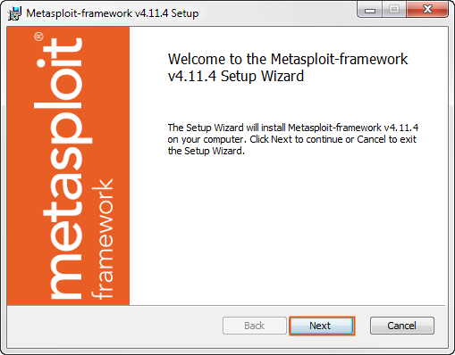
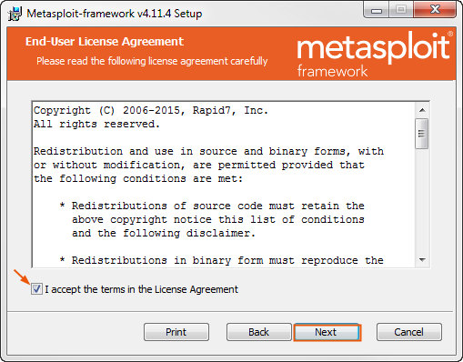
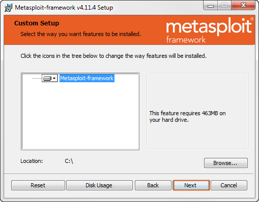
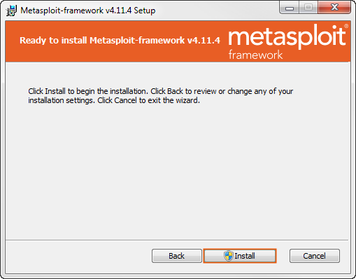

# Metasploit Framework Installer

Author: Rapid7 LLC

Before install Metasploit Framework, please turn off all antivirus and firewall.

For termux installation:

$apt install git -y

$git clone https://github.com/471D38UNNUX/Metasploit-Framework-Installer

$cd Metasploit-Framework-Installer

$bash Metasploit-Framework-Installer-For-Termux.sh

For start Metasploit Framework.

$msfconsole

For linux installation:

#sudo (apt/yum/zypper) install git

#git clone https://github.com/471D38UNNUX/Metasploit-Framework-Installer

#cd Metasploit-Framework-Installer

#cd Linux

#bash Metasploit-Framework-Installer-For-(your linux based).sh

For start Metasploit Framework.

#msfconsole

For Kali installation:

#sudo apt install git

#git clone https://github.com/471D38UNNUX/Metasploit-Framework-Installer

#cd Metasploit-Framework-Installer

#cd Linux

#bash Metasploit-Framework-Installer-For-Kali.sh

For start Metasploit Framework.

#msfconsole

You can also use linux based on Debian method.

For windows installation:

First download and install git bash in this link https://git-scm.com/

After install git, open your cmd and run this script:

git clone https://github.com/471D38UNNUX/Metasploit-Framework-Installer

cd Metasploit-Framework-Installer

Metasploit-Framework-Installer-For-Windows.bat

After downloaded, open metasploitframework-latest.msi.

Follow this instruction:

Click Next to continue.

Select the I accept the license agreement and click Next to continue.

Browse to the location where you want to install the Metasploit Framework. After that, click Next to continue.

Click Install

After the installation completes, click Finish.

Close your cmd and open it again as administrator.

Browse your Metasploit Framework location ex: F:\metasploit-framework\bin

Run msfdb init

Run msfconsole

Enjoy.

Nb: I'm not owner this tool, but i just made installation for usage more easier.

For more information you can visit official website: https://www.rapid7.com/products/metasploit/

Official repository: github.com/rapid7/metasploit-framework

Rapid7 channel: https://www.youtube.com/channel/UCnctXOUIeRFu1BR5O0W5e9w

